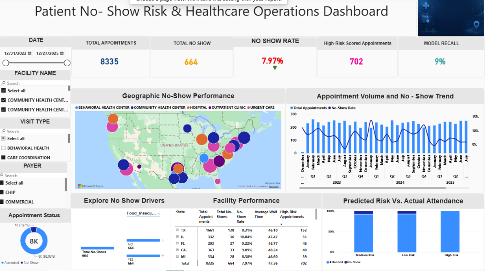

# Patient No-Show Risk & Healthcare Operations Dashboard

## Project Overview

This project uses Power BI and predictive analytics to examine patient appointment no-shows. The interactive dashboard helps healthcare leaders monitor performance, identify high-risk appointments, analyze facility differences, and support targeted patient outreach.

## Dashboard Overview

## Business Problem

Patient no-shows create unused provider capacity, scheduling inefficiencies, revenue losses, and delays in patient care.

## Project Objective

Identify the appointments, facilities, and time periods that should be prioritized to reduce patient no-shows and improve healthcare operations.

## Tools Used

* Power BI
* Power Query
* DAX
* SQL
* Python
* Google Colab
* Excel
* Azure Maps

## Project Workflow

1. Extracted and reviewed the healthcare data.
2. Cleaned, filtered, and transformed the data.
3. Removed duplicates and handled missing values.
4. Created fact and dimension tables.
5. Established relationships using a star schema.
6. Developed DAX measures and calculated columns.
7. Prepared and evaluated a patient no-show prediction model.
8. Built an interactive Power BI dashboard.
9. Generated business insights and recommendations.

## Dashboard Features

* Date, facility, visit type, and payer slicers
* KPI cards
* Azure Map
* Year, quarter, and month drill-down
* Decomposition tree
* Facility performance matrix
* Conditional formatting
* Cross-filtering
* Drill-through
* Report-page tooltips
* Predictive risk analysis

## Facility Tooltip

The report-page tooltip displays appointment volume, total no-shows, no-show rate, and the monthly no-show trend for the selected facility.

## Key Insights

### Case 1: No-Show Trend

* **Positive:** The no-show rate decreased from 8.74% in 2024 to 7.16% in 2025.
* **Negative:** Q3 2024 had the highest complete-quarter no-show rate at 9.37%.

### Case 2: Facility Performance

* **Positive:** Community Health Center 25 achieved a low 5.38% no-show rate.
* **Negative:** Community Health Center 11 recorded a high 10.73% no-show rate.

## Recommendations

* Continue the reminder and patient-support practices associated with the 2025 improvement.
* Strengthen appointment confirmation and transportation support before high-risk periods.
* Study and replicate successful practices from Community Health Center 25.
* Prioritize Community Health Center 11 for targeted outreach and rapid rescheduling.
* Improve the prediction model by adding prior no-show history, lead time, reminder response, and rescheduling history.

## Dataset

This project uses a custom synthetic healthcare dataset inspired by publicly available information from Synthea, CMS, and CDC. It contains no real patient-identifying information and is intended for educational and portfolio purposes.

## Data Sources

* [Synthea Synthetic Patient Data](https://synthetichealth.github.io/synthea/)
* [CMS Provider Data](https://data.cms.gov/provider-data/)
* [CDC PLACES](https://www.cdc.gov/places/)

## Author

**Vestine Nimenya**

* [LinkedIn](https://www.linkedin.com/in/vestine-nimenya-17188b267/)
* [GitHub](https://github.com/2Jay-bi)
